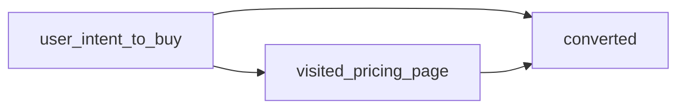
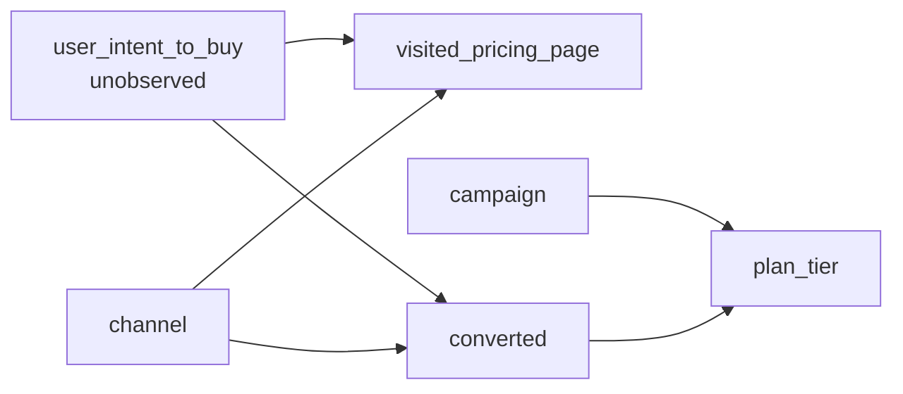
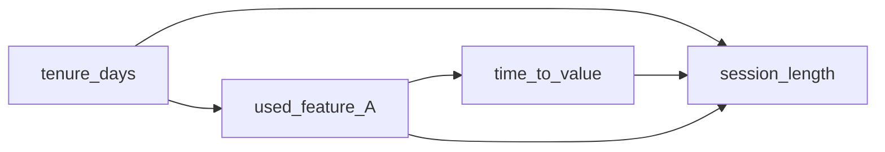

# Causal DAG builder

Observational analytics tempts everyone into two mistakes: assuming correlation is cause, and "controlling for everything" to launder it. Both mistakes go away when the assumed causal structure is written down first. A DAG forces the assumptions onto paper, where they can be argued with. This skill emits one, refines it as evidence arrives, and uses the back-door criterion to pick the adjustment set — instead of throwing every available variable into a regression.

## When NOT to use this

- The comparison is a properly-randomised A/B test with clean exposure events. Randomisation handles confounding by construction; the DAG adds nothing. Use `experiment-result-reader` instead.
- The user is asking a descriptive question ("how many users converted last week?"), not a causal one. Descriptive answers don't need causal structure.
- The DAG would have a single arrow (X → Y, no other variables in the system). That's not a DAG, that's an assertion. Either there genuinely are no other variables (rare) or the modeller hasn't thought hard enough yet.
- The dataset is so thin that no adjustment set has support. A DAG can tell you which variables to condition on; it cannot conjure rows that aren't there.

## What a DAG is, in 100 words

A causal DAG is a directed acyclic graph where **nodes are variables** and **arrows mean "directly causes"** (in the modeller's belief, not in the data). Acyclic = no variable causes itself through a loop. The DAG encodes **assumptions**, not facts; it is the modeller's hypothesis about the data-generating process, drawn so others can attack it. The point is not the picture. The point is that once the structure is explicit, the back-door criterion mechanically tells you which variables to condition on to estimate a causal effect — and, just as important, which variables you must **not** condition on.

## The three structural patterns

Every triple of nodes in a DAG is one of three shapes. Conditioning rules differ for each.

| Pattern | Shape | Role of middle node | Condition on it? |
|---|---|---|---|
| Chain | X → M → Y | Mediator | **No** (over-adjustment: blocks the effect you're trying to measure) |
| Fork | X ← C → Y | Confounder | **Yes** (blocks a back-door path that would otherwise bias the estimate) |
| Collider | X → C ← Y | Collider | **No** (opens a spurious path that wasn't there) |

The asymmetry is the whole game. "Control for everything available" is wrong because it silently conditions on mediators and colliders. The DAG is the bookkeeping that prevents that.

## The back-door criterion

To estimate the causal effect of X on Y from observational data, find a set of variables Z such that:

1. Z **blocks every back-door path** from X to Y. A back-door path is any path from X to Y that starts with an arrow pointing **into** X (i.e. goes through a common cause of X and Y).
2. Z **contains no descendants of X**. (Conditioning on a descendant of X often opens a collider path or blocks a mediator.)
3. Z does **not open any collider path** that was previously blocked.

If such a Z exists, conditioning on Z is sufficient to recover the causal effect. If no such Z exists from observed variables, the effect is **not identifiable** from this data — and no amount of regression will fix that. Saying so is a real answer.

## Method

### Phase 1. Name the causal question

Before drawing anything, state the question in the form **"does X cause Y, and by how much?"** with X and Y written as observable variables. If the user said "users who visit /pricing convert higher", X = visited_pricing_page (binary), Y = converted (binary). If the user said "feature A drove the lift", X = used_feature_A, Y = the conversion metric they care about.

If X and Y can't be written down concretely, the question isn't ready for a DAG. Push back and ask the user to nail the variables before the structure.

### Phase 2. List candidate variables

Brainstorm the variables the modeller believes might matter. For each, label which of these it is:

- **Plausible cause of X** (would push someone toward the behaviour)
- **Plausible cause of Y** (would push someone toward the outcome)
- **Caused by X** (downstream of the behaviour)
- **Caused by Y** (downstream of the outcome)
- **Caused by both X and Y** (collider — flag and remember)

The same variable can appear in multiple buckets; that's where structure comes from. Don't censor at this stage; capture the modeller's beliefs, even ones that contradict each other. The DAG arbitrates next.

### Phase 3. Draw the minimal DAG in Mermaid

Emit the DAG as Mermaid so it lives in the chat as a refinable artifact. Concrete syntax:



Conventions:

- Use `graph LR` (left-to-right) — easier to read than top-down for short DAGs.
- Node IDs are short snake_case; the label in brackets is the human-readable name.
- One arrow per assumed direct cause. No bidirectional arrows (those are not DAGs; replace with an unobserved common cause).
- If a variable is unobserved or latent, suffix the label with `(unobserved)` so downstream skills know it cannot be conditioned on.

Start minimal: X, Y, and the two or three most plausible confounders. Resist the urge to draw twenty nodes.

### Phase 4. Walk the back-door paths

For each path from X to Y that does **not** start with X → (i.e. an arrow leaving X), it's a back-door path. List them. Decide for each:

- Does the path contain a confounder (fork) that needs to be blocked by conditioning?
- Does the path contain a collider that is already blocking it (without conditioning, colliders block by default)?
- Does the path go through a mediator? (If yes: this is a **front-door** path, not back-door — keep it open, do not condition on the mediator.)

Compute the smallest Z that blocks all back-door paths without opening collider paths. That's the adjustment set. If no Z is available from observed variables, declare the effect **not identifiable** and stop pretending a regression will reveal it.

### Phase 5. Hand the adjustment set to the next skill

Downstream skills — `channel-and-funnel-quality` when comparing channels, `metric-context-and-benchmarks` when calibrating absolute rates, raw cohort-comparison queries via Clamp MCP `cohorts_compare` — read the DAG and the chosen Z to decide their adjustments. The DAG output should make Z explicit:

```
ADJUSTMENT SET (Z): {user_intent, channel}
DO NOT CONDITION ON: {plan_tier (collider), time_to_value (mediator)}
UNOBSERVED IN Z: {user_intent} — effect is point-identified ONLY if a proxy is added
```

If `user_intent` is unobserved and no proxy exists, say so plainly. The honest answer is "we can describe the correlation; we cannot estimate the causal effect from this data."

### Phase 6. Refine as evidence arrives

The DAG is not done after Phase 5. As later queries surface new variables (a property in `events_observed_schema`, a segment in `cohorts_list`, an unexpected mediator from a `users_journey` trace), update the DAG by adding the node and the assumed arrows, then re-run Phase 4. Most real investigations cycle through 2–4 refinements before the structure is stable. The Mermaid block in the chat is the refinable artifact; replace it in place rather than appending.

## Worked example 1: Simpson's paradox on /pricing

```
User: users who visit /pricing convert 3× higher. Should we drive
more traffic to /pricing?

Agent: That's a causal claim from observational data. Let me draw
the DAG before answering.

Phase 1. Question.
  X = visited_pricing_page (binary)
  Y = converted (binary)
  Effect of interest: does visiting /pricing cause conversion?

Phase 2. Candidate variables.
  - user_intent_to_buy: causes BOTH X (high-intent users seek the
    pricing page) AND Y (high-intent users convert). Likely
    unobserved.
  - channel: causes X (paid-search users land on /pricing more
    often) and may cause Y.
  - plan_tier: caused by Y (you only have a tier if you converted),
    and caused by campaign. Collider — do NOT condition on.

Phase 3. Minimal DAG.



Phase 4. Back-door walk.
  Path 1: pricing ← intent → conv. Back-door via intent. Need to
    condition on intent — but intent is unobserved.
  Path 2: pricing ← channel → conv. Back-door via channel. Block
    by conditioning on channel.
  Path through plan_tier: pricing has no arrow to tier, but if we
    naively control for tier we open the collider conv → tier ←
    campaign, biasing the estimate. Do NOT condition on tier.

Phase 5. Adjustment set.
  ADJUSTMENT SET (Z): {channel}
  DO NOT CONDITION ON: {plan_tier}
  UNOBSERVED IN Z: {user_intent} — back-door path via intent stays
    open. The causal effect of visiting /pricing on conversion is
    NOT point-identifiable from this data.

Verdict:
  The "3× conversion lift" is largely intent confounding. High-
  intent users seek out /pricing AND convert; the page itself
  may contribute very little. Driving low-intent traffic to
  /pricing will not reproduce the 3× lift, and may produce
  no lift at all.

  What would identify it: a randomised redirect that sends a
  fraction of inbound users through /pricing regardless of
  intent signal. Without that, the question is descriptive
  only.
```

## Worked example 2: the mediator trap

```
User: feature A causes a 30% session-length increase. We've
controlled for time_to_value. Confidence?

Agent: Drawing the DAG first.

Phase 1. Question.
  X = used_feature_A (binary)
  Y = session_length (continuous, seconds)
  Effect of interest: causal effect of using feature A on session
  length.

Phase 2. Candidate variables.
  - time_to_value: caused by feature A (users who use A reach value
    faster), and causes Y (users who reach value stay longer).
    This is a MEDIATOR, not a confounder.
  - tenure_days: causes X (long-tenure users have explored more
    features) and causes Y (long-tenure users have heavier sessions
    on average). Confounder.

Phase 3. Minimal DAG.



Phase 4. Back-door walk.
  Path 1: feat ← tenure → sess. Back-door via tenure. Block by
    conditioning on tenure.
  Path 2: feat → ttv → sess. This is FRONT-door (a mediated
    pathway from X to Y). Conditioning on ttv blocks the part of
    the effect that runs through ttv — i.e. understates the
    total effect of feature A.

Phase 5. Adjustment set.
  ADJUSTMENT SET (Z): {tenure_days}
  DO NOT CONDITION ON: {time_to_value} — mediator; over-adjustment
    will understate the effect.

Verdict:
  By conditioning on time_to_value, the analysis is measuring
  only the direct effect of feature A on session length, holding
  time-to-value fixed. The headline "30% lift" is the residual
  after blocking the main causal pathway (faster time-to-value →
  longer sessions). The total causal effect is likely larger
  than 30%, not smaller. Re-run without conditioning on ttv,
  with tenure_days as the only control. If a decomposition into
  direct vs mediated effect is wanted, that's a mediation
  analysis — different skill.
```

## Traps to avoid

- **Conditioning on a collider because it "looked like a confounder".** Colliders are the most common silent failure. Plan tier, churn status, subscription state — anything that exists only as a consequence of the outcome is a collider with respect to its causes. Drawing the DAG is the only reliable way to spot them.
- **Drawing arrows from common-sense correlations.** "Country → conversion" because conversion rates vary by country is not a causal arrow; it's a marginal association. The DAG should reflect believed direct causation, not observed correlation. Ask "if I intervened on country, holding everything else fixed, would conversion change?" before drawing the arrow.
- **Refusing to mark variables as unobserved.** If user intent matters and you don't have a proxy for it, write `user_intent (unobserved)` and let Phase 4 declare the effect non-identifiable. Pretending an unobserved confounder isn't there because no column exists for it is how observational claims get shipped as causal ones.
- **Treating the DAG as final.** First-pass DAGs are wrong. The point is they're wrong in a way you can see and argue with. Refinement in Phase 6 is the work, not the cleanup.
- **Drawing too many nodes too early.** Twenty-node DAGs are unreadable. Start with X, Y, and the two or three most plausible confounders. Add nodes when evidence forces them in.

## Cross-references

- **`analytics-diagnostic-method`**: the diagnostic tree assumes some causal structure is in your head. This skill makes it visible. Run the DAG builder before formulating hypotheses in the tree, so each hypothesis can be tied to a back-door path or a mediator.
- **`channel-and-funnel-quality`**: when comparing channel performance, the DAG names the confounders the channel comparison must adjust for. Without it, "channel A converts better" usually means "channel A's users had higher intent".
- **`experiment-result-reader`**: the alternative when a real experiment exists. Randomisation cuts the back-door paths by construction, so the DAG collapses to X → Y plus whatever covariates the modeller wants for precision (not identification).
- **`metric-context-and-benchmarks`**: once the adjustment set is chosen, this skill is where the conditioned-on rate gets compared to industry calibration.

## Sources

- [CRAN ggdag — Introduction to DAGs](https://cran.r-project.org/web/packages/ggdag/vignettes/intro-to-dags.html) — the three structural patterns and the back-door criterion at working-analyst depth.
- [Pearl, "A Probabilistic Calculus of Actions" / r60](https://causalai.net/r60.pdf) — the formal back-door / front-door criteria and identifiability conditions.
- [McElreath, "Statistical Rethinking" — DAG chapter](https://xcelab.net/rm/statistical-rethinking/) — the case for DAGs as the unit of causal reasoning, with the cleanest collider explanations in the literature.
- [Causal Data Science — DAG fundamentals](https://owmork.github.io/causal_ds/content/fundamentals/04_dag.html) — practitioner-oriented walkthrough including worked Simpson's-paradox examples.
